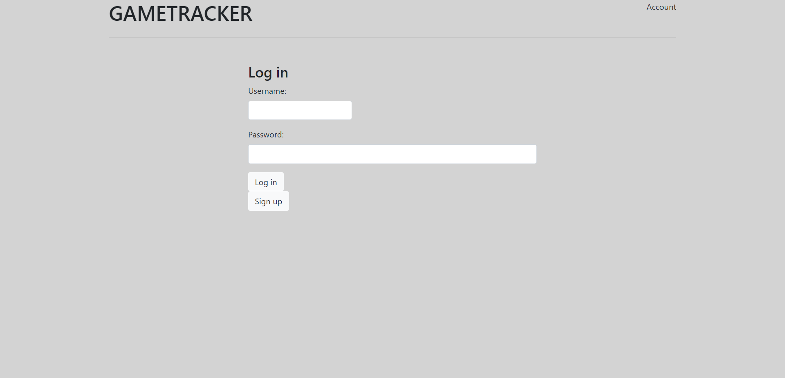
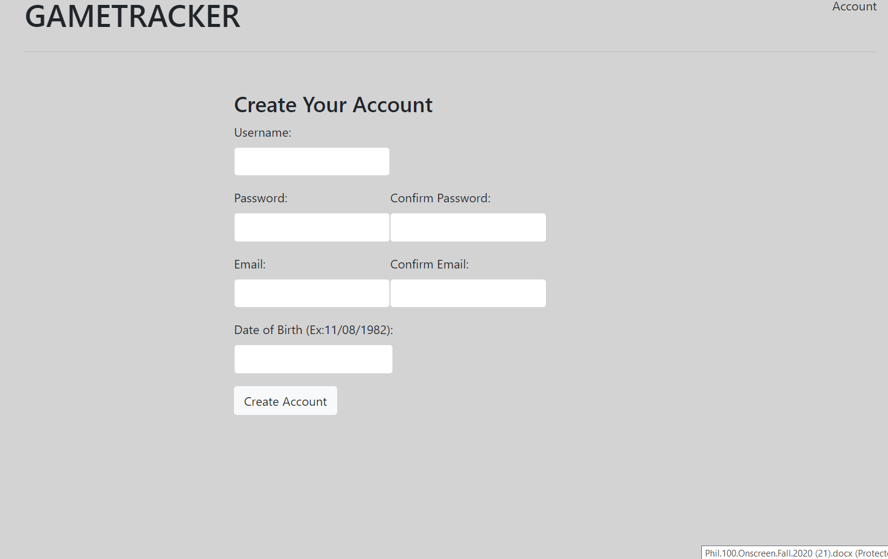
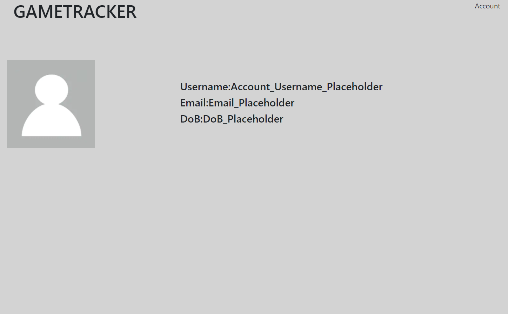
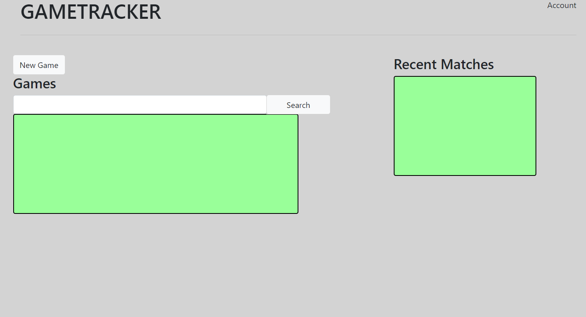
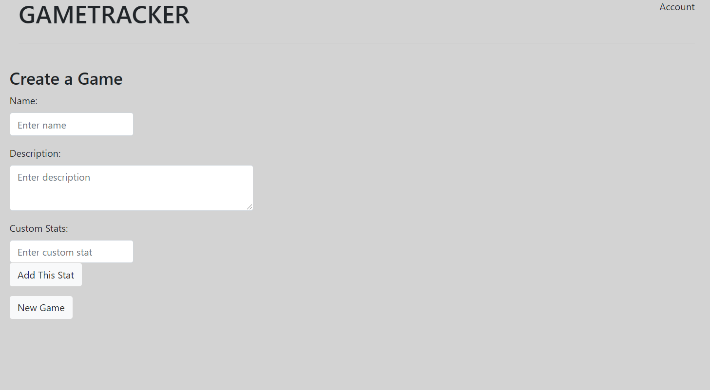
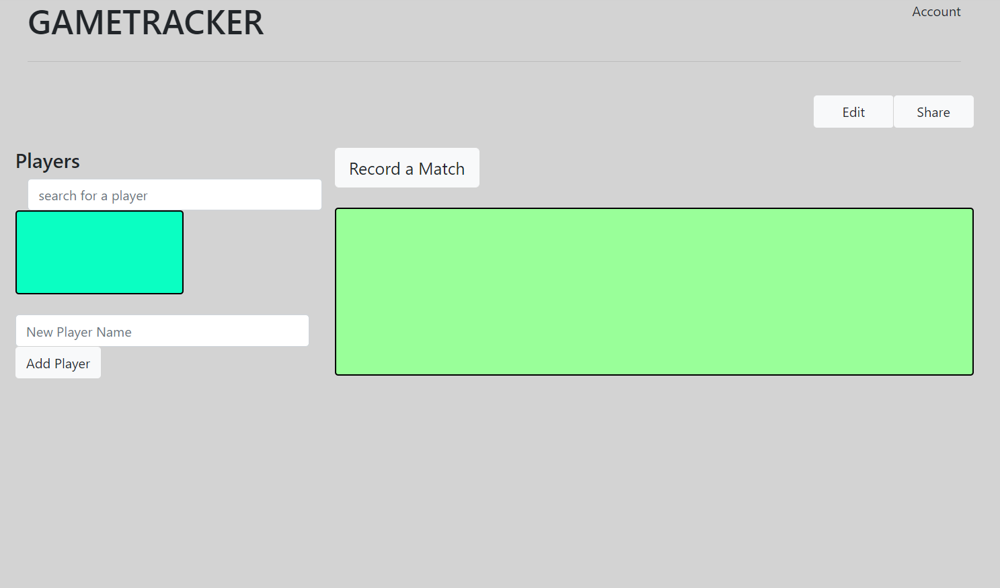
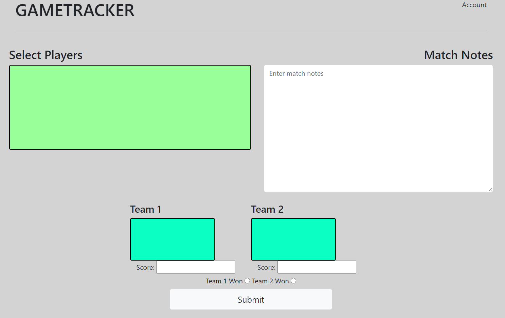

# Team Yod
## Game Tracker
## Fall 2020
- Conner Nelson (cenelson52), Joseph O'Leary (jpoleary), Dang Le Nguyen (dang592)

## Overview:
For our project, we created a game tracker that allows users to create an account, create games w/ custom statistics, and create and track matches, teams, and players through each game. This allows users to decide exactly what they wish to track for their own performance, as well as others, and shape their experience accordingly.

## User Interface:
- Log in Page
    - A simple login page with sign up and login buttons.

    

- Create Account Page
    - A straight forward account create page where you enter in basic information

    

- Account page
    - Displays basic account information

    

- Homepage
    - Shows you all of the games you've created that you can search through and shows recent matches played among all the games. Lets you create a match or click into any game you have.

    

- Game Creation page
    - Allows user to enter title, description, and any number of custom stats.

    

- Game Home
    - Has a list of players that you can add to as well as search through. Shows a list of all matches for this game and has a button for recording new matches.

    

- Match Recording Page
    - This page allows you to enter all the information for a match. Players from the game can be selected and put into one of the two teams and if you click on the player once their on a team, you can edit their stats for this match. A description/notes about the match can be written and info about the score and who won are also recorded.

    

## APIs:

## Database:

### User Table
| Column        | Counter Name | Data Type | Description                    |
|---------------|--------------|-----------|--------------------------------|
| User ID       | userid       | Integer   | ID for the user                |
| Username      | username     | Text      | Name set by user               |
| Password      | password     | Text[]    | Salt & (encoded) password      |
| Date of Birth | dob          | Text      | Date of birth                  |
| Game IDs      | gameids      | Text[]    | Holds ids for the user's games |

### Game Table
| Column        | Counter Name | Data Type | Description                    |
|---------------|--------------|-----------|--------------------------------|
| Game ID       | gameid       | Integer   | ID for the game                |
| Game Name     | name         | Text      | Name of the game               |
| Description   | descrip      | Text      | Short description of game      |
| Matches       | matches      | Integer[] | All matches for the game       |
| Stats         | stats        | Text[]    | Custom statistics for matches  |

 ### Match Table
| Column        | Counter Name | Data Type | Description                    |
|---------------|--------------|-----------|--------------------------------|
| Match ID      | matchid      | Integer   | ID for the match               |
| Game ID       | gameid       | Integer   | ID for game it belongs to      |
| Match Object  | match        | Text      | Match object containing info   |

## URL Routes / Mapping
| URL                      | Description | 
|--------------------------|--------------|
| /login.html              | Used for Logging into existing accounts |
| /accountcreate.html      | Used to create accounts |
| /account.html            | Shows basic account information. User should be logged in |
| /homepage.html           | Used to navigate to games or create them. User should  be logged in |
| /game.html               | Show information about selected game and navigates to match recording. User should  be logged in |
| /gamecreate.html         | Used to create new games. User should  be logged in |
| /match.html              | Used to record matches of a game. User should  be logged in |

## Authentication/Authorization
When a player creates an account, their password is hashed using miniCrypt.js and stored in the database along with the rest of their account information. When attempting to log in with that user, the hashed password, along with it's hash, is passed through the appropriate Passport.js processes in order to authenticate that user. The user would stay logged in and authenitcated until logged out, and a user must be authenticated in order to access any data associated with that user. Unfortunately, the authentication system wasn't finished in time for the due date, and isn't fully implemented.

## Division of Labor
- Joseph O'Leary
    - Markdown docs
    - Group grading rubric
    - CSS
    - HTML on Homepage, GameCreate, Match, and Game
    - Javascript for server.js, accountcreate.js, homepage.js
    - .gitignore
    - Setting up and (trying to) connect database
    - Starting miniCrypt.js + Passport.js
    - Heroku
- Dang Le Nguyen
    - Wireframes
    - CSS
    - HTML for Account, AccountCreate
    - server.js, database.js, dataExs.js
    - account.js, accountcreate.js
    - package.json
    - Heroku
- Connor Nelson
    - Idea
    - Markdown Doc
    - Wireframes
    - CSS
    - HTML for Homepage, GameCreate, Match
    - gamecreate.js, game.js, match.js
    - server.js, dataExs.js
    - Heroku

## Conclusion
Through the process of this project, our group got a lot of practice with HTML and Javascript, along with the API processes that allowed us to create our server. There were some areas where we struggled, one of which being the implementation of Passport.js and authentication, which made it difficult to finish with the final APIs and connecting the server to our database. We also had a fair amount of difficulties successfully deploying to heroku, but we ended up figuring it out. Something we would've liked to know earlier is how much of a time commitment that this project would be, overall our time management was lacking.

## [Heroku Link](https://cs326final-yod.herokuapp.com/)

## [Group Rubric](https://docs.google.com/document/d/19Is_zDfItgZADYcGi1ZmJDmwcIfuEcGv_xT66GCTLm4/edit?usp=sharing)

