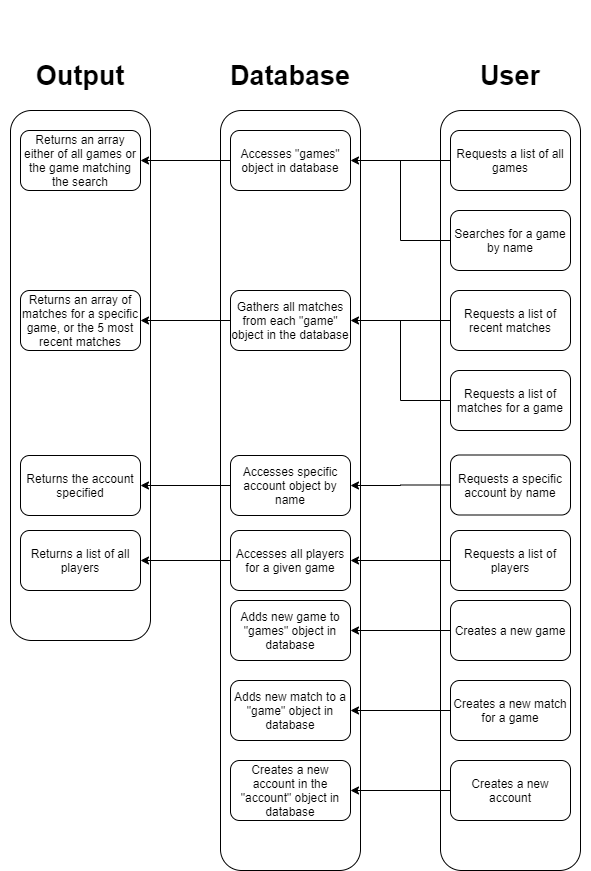

# Milestone 2

## Division of Labor
- Joseph O'Leary
    - accountcreate.js, account.js, homepage.js
    - server.js
    - Division of Labor, API Flowchart, helping w/ Heroku 
    
- Connor Nelson
    - gamecreate.js, game.js, match.js
    - server.js, dataExs.js
    - Heroku
    
- Dang Le Nguyen
    - server.js and database.js
    - tourney.js, tourneycreate.js, account.js, accountcreate.js
    - dataExs.js

## API Documentation
Flowchart:

## Screenshots

Create
An user creates their account by entering the information in the fields provided.

Read
The page reads if an username or email already taken.

Update

Delete

## [Heroku Link](https://cs326final-yod.herokuapp.com/)
